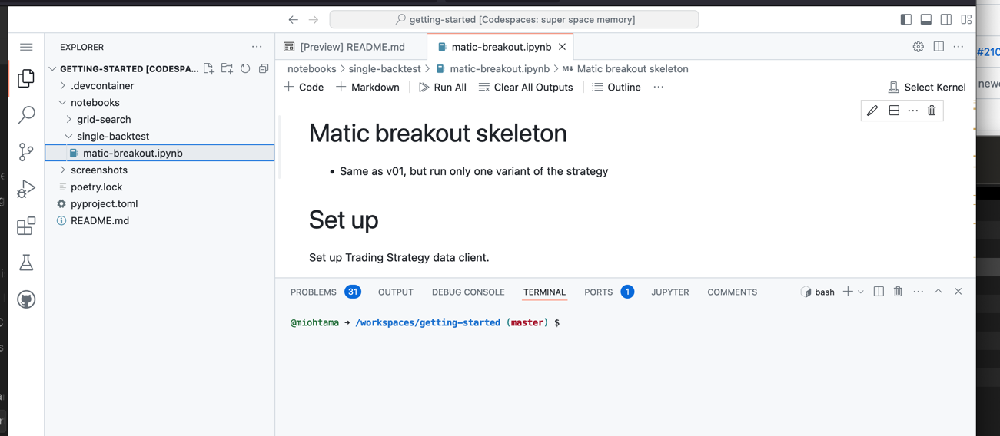
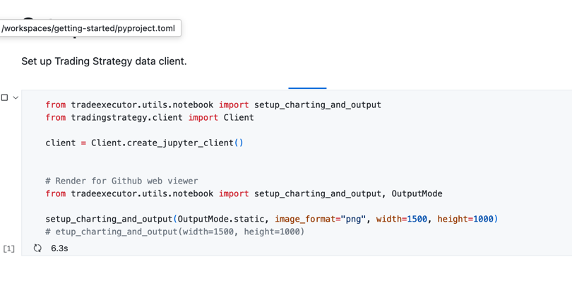
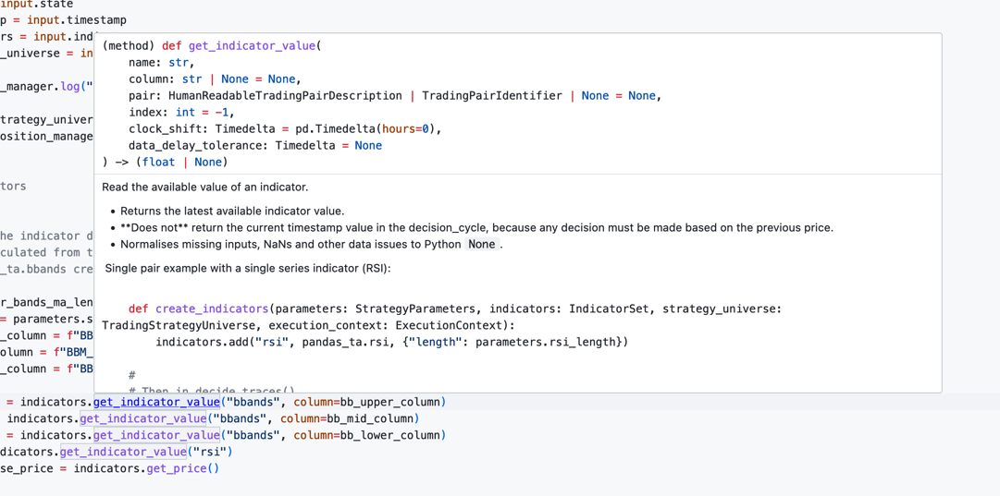

 # Getting started
 
- This is an example repository for [Trading Strategy framework](https://tradingstrategy.ai) to 
  get started bringing your [algorithmic trading strategy](https://tradingstrategy.ai/glossary/algorithmic-trading) to decentralised finance
- This allows you to develop and backtest your trading strategies against DeFi and [Binance CEX](https://tradingstrategy.ai/glossary/cex) data
- This repository contains multiple example backtesting  [notebooks](https://tradingstrategy.ai/glossary/jupyter-notebook) to get started 

# Prerequisites

- Github user account 
  - The Docker container image running the development environment is hosted on [Github Container Registry](https://github.com/features/packages)
- Basic Python and data science knowledge
  - Python scripting
  - Pandas
  - Jupyter Notebook
- Basic algorithmic trading knowledge 
  - Understanding price chart and price action
  - Technical indicators

For complex strategies that process a lot of data we recommend running a local development environment with minimum of 16 GB RAM.

# Options to develop trading strategies

You can either run and edit these examples 

- In cloud, in your web browser, using Github Codespaces (very simple, but slower)
- Locally using Visual Studio Code (faster, but more expertise required)
- Any Python editor you wish (super fast, tailored to your flavour, but senior Python expertise required)

# Example strategies

You can find these example strategies

- An example RSI breakout strategy for Bitcoin on Binance data
- An example EMA strategy for ETH on Uniswap v3 on Arbitrum

# How to run on Github Codespaces

Press **Create codespaces** on [Github repository page](https://github.com/tradingstrategy-ai/getting-started).


This will give you a page showing your codespace is being launched.


After a while your Github Codespaces cloud environment is set up. The first launch is going to take a minute or two.



Open a notebook: **notebooks/single-backtest/matic-breakout.ipynb**. 

After opening the notebook click **Clear all Outputs** and then **Run all** button Jupyter toolbar.


When you are asked to *Select kernel*. Choose *Python Environments..* and then `/usr/local/bin/python`.


You should see now notebook running, indicated by the progress indicator and run time count down in each notebook cell.



After the notebook is running successfully, you should be able to press **Go to** on the toolbar and see the backtesting progress bar going on. 
You will see a separate progress bar for 1) downloading data (done only once) 2) calculating technical indicators 3) running the backtest.


**Note**: If you see a text `"Error rendering output item using 'jupyter-ipywidget-renderer. this is undefined.` it means Visual Studio Code/Github Codespaces has encountered an internal bug.
In this case press **Interrupt** on a toolbar, close the notebook, open it again and press **Run all** again. It happens only on the first run.

Shortly after this backtests results are available.

You can find them by scrolling down to the different sections

- Equity curve
- Performance metrics

# How to run: local Visual Studio Code

- Check out [this Github repository]() on your local computer
- Visual Studio code should prompt you "Do you wish to run this in Dev Container"
- Choose yes
- Follow the same steps as in *How to run on Github Codespaces* above 

**Note**: If you run on a local Sometimes the toolbar does not appear, as Visual Studio Code fails to install extensions on the first run: in this case you need to restart your Visual Studio Code and it should work

# Strategy skeleton

Each strategy backtest notebook will consist of following phases. 

- **Set up**: Create Trading Strategy client that will download and cache any data
- **Parameters**: Define parameters for your strategy in `Parameters` Python class
- **Trading pairs and market data**: Define trading pairs your strategy will use and method to construct a trading universe using `create_trading_universe()` Python function.
  This function will take your trading pairs and additional information (candle time frame, stop loss, needed lending rates) and construct Python dataset suitable for 
  backtesting. See documentation.
- **Indicators**: In this phase, you have `create_indicators` function. You define indicator names, parameters and functions for your strategy.
  Indicators are defined as a separate step, as indicator calculation is performed only once and cached for the subsequent runs.
  See documentation.
- **Trading algorithm**. Here you define `decide_trades` function that contains the trading strategy logic.
  It reads price data and indicator values for the current `timestamp` of the decision cycle. Then it outputs a list of trades.
  Trades are generic by `PositionManager` of which functions `open_position` and `close_position` are used to open individual trading positions.
- **Backtest**: This section of the notebook runs the backtest. Here is a progress bar displayed about the current running backtest,
  and any errors you may encounter. We use function `run_backtest_inline()` that gives us the backtest's `state` Python object,
  which contains all the information about the backtest execution we can then analyse.
- **Output**: You can have various visualisation and tables about the strategy performance. These include e.g. **Equity curve**,
  **Performance metrics** (max drawdown, Sharpe, etc) and **Trading statistics**.

This is a rough skeleton. You mix and match can easily add your own trading signals and output charts using with all tools available in Pandas and Jupyter notebook ecosystem.
There aren't any limitations on what you can do.

# Grid search skeleton

The grid search is the same invididual backtest with very minimal changes
- **Parameters** class has single parameter values replaced with Python lists to explore all the list combinations in the grid search
- **Backtest** runs `perform_grid_search` instead of `run_backtest_inline`
- **Output** shows summaries backtest results and heatmaps

Grid search are taxing on a computer, so we recommend running grid searches only on local powerful computers.

# Editing notebook

You can edit the backtest notebook

- Edit any changes
- Press **Clear output**
- Press **Run all** to rerun everything

## Tooltips

Any function will give it's Python documentation as a tooltip on mouse hover.



# How to

## Develop a trading strategy
 
- Have a trading idea
- Create the first prototype with data sources and indicators using centralised exchange data like Binance
  - Decentralised market have often too little history to make any kind of analysis
- Validate your backtest robustness by testing shifting timeframes around
- After happy with the strategy, Change the backtesting to real decentralised data
- Convert the backtest notebook to a Trading Strategy Python module
- Launch the live trading strategy


## Add indicators

## Visualise indicators

# Learning resources

- [Trading Strategy documentation](https://tradingstrategy.ai/docs/)
- [About Github Codespaces](https://github.com/features/codespaces)
- [About Visual Studio Dev Containers](https://code.visualstudio.com/docs/devcontainers/containers)

# Troubleshooting

**Note to Mac users**: The current Docker image is built for Intel platform. If you run Dev Container
on your Mac computer with Visual Studio Code, the backtesting speed is slower than you would get otherwise. 

- [Rebuilding Dev Containers for Github codespaces](https://docs.github.com/en/codespaces/developing-in-a-codespace/rebuilding-the-container-in-a-codespace)
- [Dev Container CLI](https://code.visualstudio.com/docs/devcontainers/devcontainer-cli)
- [Microsoft default Dev Container image for Python](https://github.com/devcontainers/images/tree/main/src/python)
- [Dev Container Github Action](https://github.com/devcontainers/ci/blob/main/docs/github-action.md)
- [Dev Container JSON reference](https://code.visualstudio.com/docs/devcontainers/create-dev-container)

Testing the Dev Container build:

```shell
devcontainer up --workspace-folder . 
```

Checking installed packages wihtin Codespaces terminal:

```shell
pip list
```