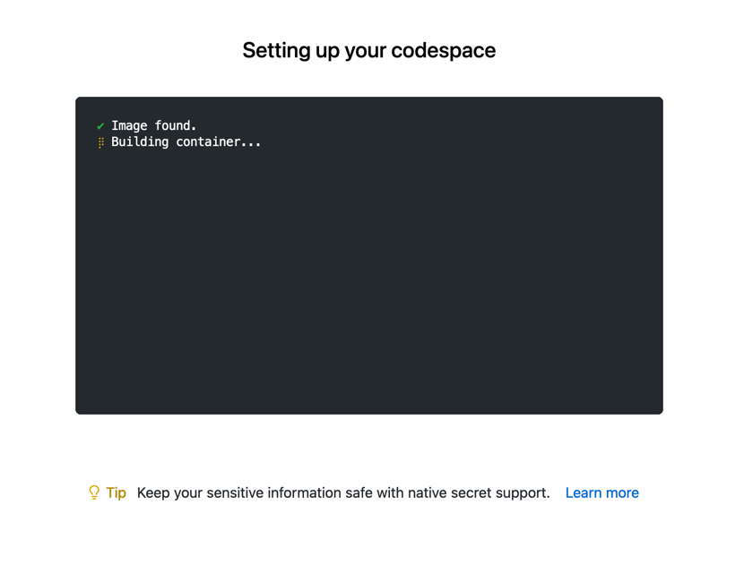

 # Getting started
 
- This is an example repository for [Trading Strategy framework](https://tradingstrategy.ai) to 
  get started bringing your [algorithmic trading strategy](https://tradingstrategy.ai/glossary/algorithmic-trading) to decentralised finance
- This allows you to develop and backtest your trading strategies against DeFi and [Binance CEX](https://tradingstrategy.ai/glossary/cex) data

# Prerequisites

- Github user account 
  - The Docker container image running the development environment is hosted on [Github Container Registry](https://github.com/features/packages)
- Basic Python and data science knowledge
  - Python scripting
  - Pandas
  - Jupyter Notebook
- Basic algorithmic trading knowledge 
  - Understanding price chart and price action
  - Technical indicators

For complex strategies that process a lot of data we recommend running a local development environment with minimum of 16 GB RAM.

# What is contained

Click to open in your personal Github Codespaces:

- An example RSI breakout strategy for Bitcoin on Binance data
- An example EMA strategy for ETH on Uniswap v3 on Arbitrum

# How to run on Github Codespaces

Press **Create codespaces** on [Github repository]().



After a while your Github Codespaces cloud environment is set up. The first launch is going to take a minute or two.


Open a notebook: **notebooks/single-backtest/matic-breakout.ipynb**. 

After opening the notebook click **Clear all Outputs** and then **Run all** button Jupyter toolbar.


When you are asked to *Select kernel*. Choose *Python Environments..* and then `/usr/local/bin/python`.


You should see now notebook running, indicated by the progress indicator and run time count down in each notebook cell.


After the notebook is running successfully, you should be able to press **Go to** on the toolbar and see the backtesting progress bar going on. 


Shortly after this backtests results are available.


# How to run: local Visual Studio Code

- Check out [this Github repository]() on your local computer
- Visual Studio code should prompt you "Do you wish to run this in Dev Container"
- Choose yes
- Follow the same steps as in *How to run on Github Codespaces* above 

**Note**: If you run on a local Sometimes the toolbar does not appear, as Visual Studio Code fails to install extensions on the first run: in this case you need to restart your Visual Studio Code and it should work

# How to add indicators

# How to visualise indicators

# H

# How do I develop a trading strategy
- 
- Have a trading idea
- Create the first prototype with data sources and indicators using centralised exchange data like Binance
  - Decentralised market have often too little history to make any kind of analysis
- Validate your backtest robustness by testing shifting timeframes around
- After happy with the strategy, Change the backtesting to real decentralised data
- Convert the backtest notebook to a Trading Strategy Python module
- Launch the live trading strategy

# Learning resources

- [Trading Strategy documentation](https://tradingstrategy.ai/docs/)
- [About Github Codespaces](https://github.com/features/codespaces)
- [About Visual Studio Dev Containers](https://code.visualstudio.com/docs/devcontainers/containers)

# Troubleshooting

**Note to Mac users**: The current Docker image is built for Intel platform. If you run Dev Container
on your Mac computer with Visual Studio Code, the backtesting speed is slower than you would get otherwise. 

- [Rebuilding Dev Containers for Github codespaces](https://docs.github.com/en/codespaces/developing-in-a-codespace/rebuilding-the-container-in-a-codespace)
- [Dev Container CLI](https://code.visualstudio.com/docs/devcontainers/devcontainer-cli)
- [Microsoft default Dev Container image for Python](https://github.com/devcontainers/images/tree/main/src/python)
- [Dev Container Github Action](https://github.com/devcontainers/ci/blob/main/docs/github-action.md)
- [Dev Container JSON reference](https://code.visualstudio.com/docs/devcontainers/create-dev-container)

Testing the Dev Container build:

```shell
devcontainer up --workspace-folder . 
```

Checking installed packages wihtin Codespaces terminal:

```shell
pip list
```